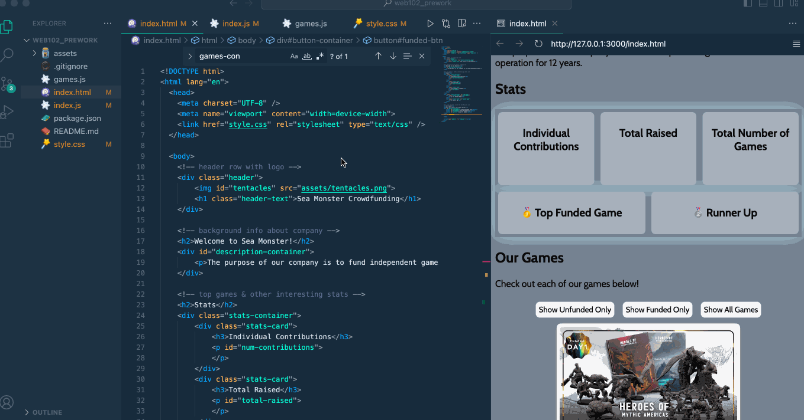
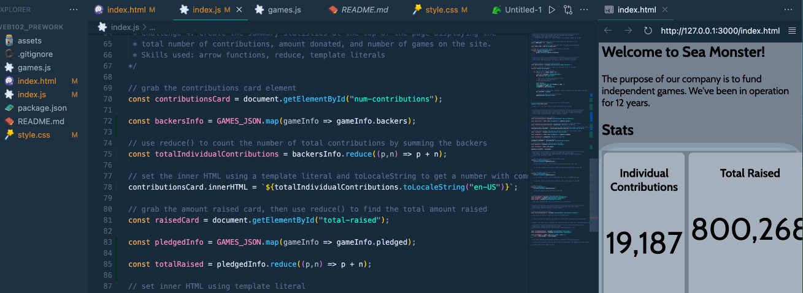
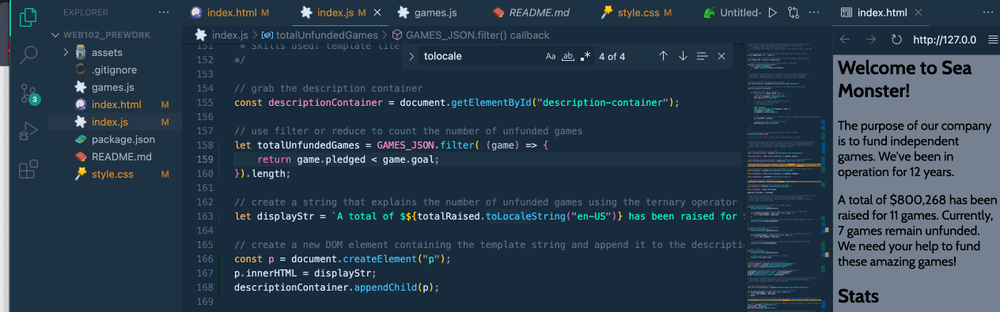
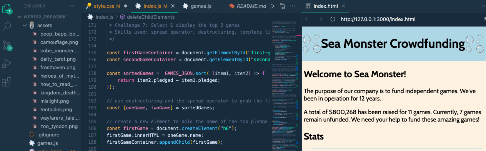

# WEB102 Prework - *Sea Monster's GoFund Me*

Submitted by: **Charlize Angeles**

**Sea Monster's GoFund Me** is a website for the company Sea Monster Crowdfunding that displays information about the games they have funded.

Time spent: **7** hours spent in total

## Required Features

The following **required** functionality is completed:

* [X] The introduction section explains the background of the company and how many games remain unfunded.
* [X] The Stats section includes information about the total contributions and dollars raised as well as the top two most funded games.
* [X] The Our Games section initially displays all games funded by Sea Monster Crowdfunding
* [X] The Our Games section has three buttons that allow the user to display only unfunded games, only funded games, or all games.

The following **optional** features are implemented:

* [X] Changed CSS styling for more visual appeal

## Video Walkthrough

Here's a walkthrough of implemented features:

Displaying all the games on the game cards from the data file

Creating the logic for calculating the statistics at the top of the page such as the total number of games and money raised

**UPDATED
Making the filter buttons operational so that the correct game cards display according to which button you press

Sum the statistics of the games on a description on the top, making it dynamic based on how many unfunded games there are

Creating the logic for finding the top two games by the pledged amount and displaying them in the statistics section of the website

<!-- Replace this with whatever GIF tool you used! -->
GIF created with LICEcap
<!-- Recommended tools:
[Kap](https://getkap.co/) for macOS
[ScreenToGif](https://www.screentogif.com/) for Windows
[peek](https://github.com/phw/peek) for Linux. -->

## Notes

I had a few areas in the code that took some extra time to work through. One was using the ternary operator to display a custom message depending on whether there was one unfunded game or multiple. Ternary operators are tricky until you get familiar with the syntax. I also needed a refresher on the different types of functions in JavaScript like arrow functions. 
Additionally, I found grabbing the top two games by pledged amount to be a small challenge. Using destructuring along with the spread operator to pull the first two items from a sorted array was a new pattern for me.

## License

    Copyright [2024] [Charlize Angeles]

    Licensed under the Apache License, Version 2.0 (the "License");
    you may not use this file except in compliance with the License.
    You may obtain a copy of the License at

        http://www.apache.org/licenses/LICENSE-2.0

    Unless required by applicable law or agreed to in writing, software
    distributed under the License is distributed on an "AS IS" BASIS,
    WITHOUT WARRANTIES OR CONDITIONS OF ANY KIND, either express or implied.
    See the License for the specific language governing permissions and
    limitations under the License.
